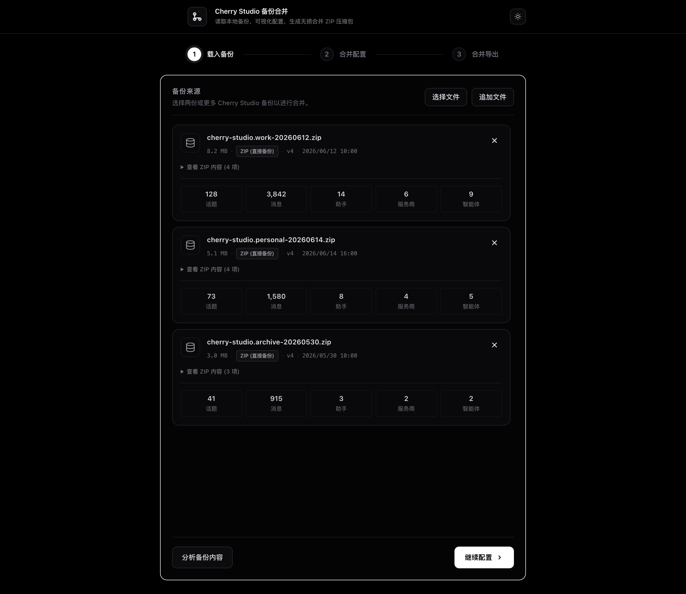
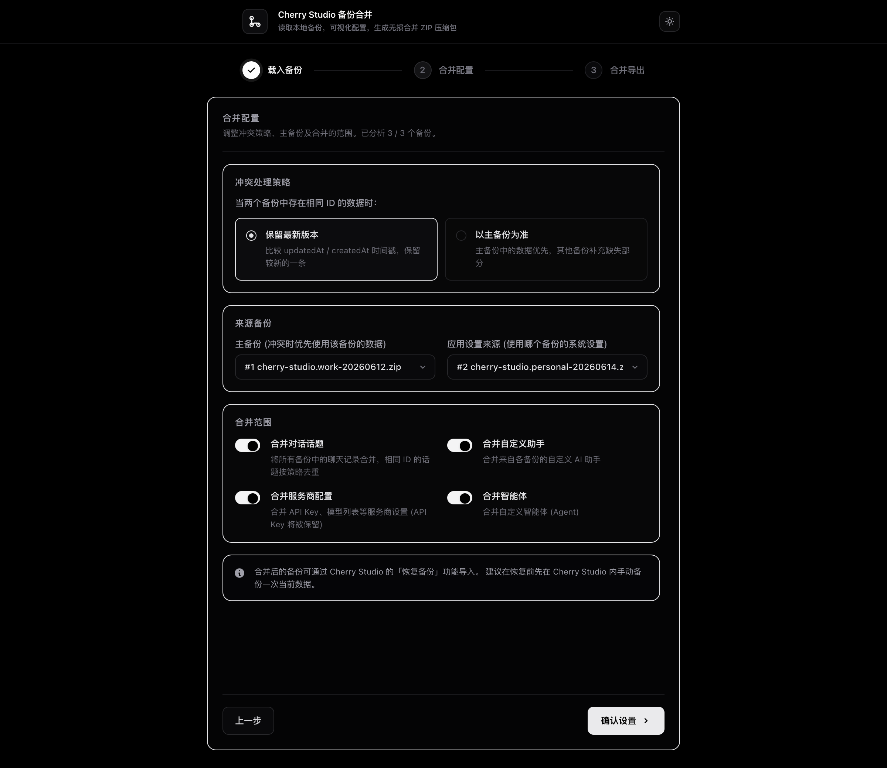
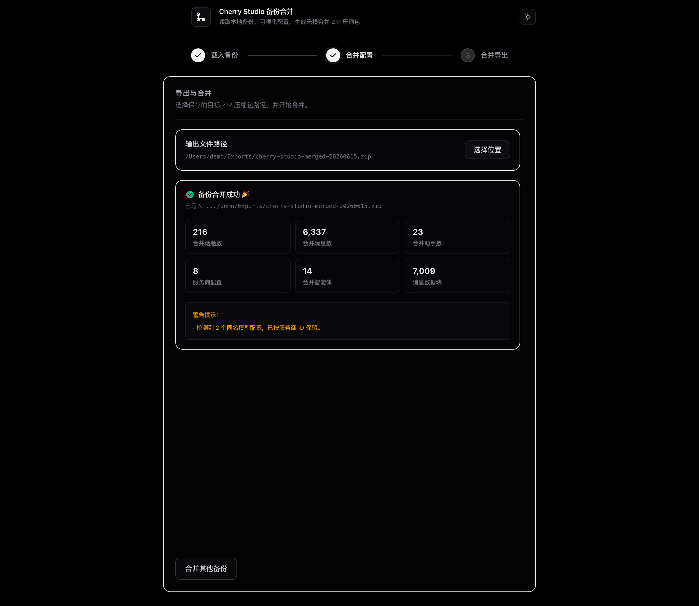

# Cherry Studio 备份合并桌面工具

用于选择两份或多份 Cherry Studio 备份，并在本机可视化配置合并策略，最终生成一份可通过 Cherry Studio「恢复备份」导入的 ZIP。

应用会在桌面端内完成备份选择、内容分析、合并配置和结果导出。若项目根目录存在 `cherry-studio.*.zip` 示例备份，桌面端启动后会自动列出；只有点击「分析备份内容」或「确认并开始合并」时才会读取数据库内容。

## Demo 预览

### 选择并分析备份



### 配置合并策略



### 导出合并结果



## 功能特性

- 多备份合并：支持一次选择 2 个或更多备份文件
- 直接备份解析：支持 Cherry Studio 新版 ZIP 备份中的 `IndexedDB` / `Local Storage`
- 附件保留：合并输出会保留 `Data/Files` 下的图片、文档等附件
- 冲突策略：可选择保留较新数据，或以主备份为准
- 范围控制：可分别控制话题、助手、服务商、智能体的合并
- 进度日志：合并过程会展示读取、解析、写入等阶段日志
- 本地处理：读取、解析、合并、写出都在本机完成

## 快速开始

环境要求：

- Node.js >= 24.0.0
- Yarn
- Playwright Chromium

安装依赖：

```bash
yarn install
yarn playwright install chromium
```

启动桌面开发模式：

```bash
yarn desktop
```

构建桌面运行文件：

```bash
yarn build
```

构建后可运行：

```bash
yarn start:desktop
```

## 使用步骤

1. 打开桌面应用。
2. 选择两份或更多 Cherry Studio 备份，支持 `.zip` / `.bak` / `.json`。
3. 可选：点击「分析备份」查看话题、消息、助手等统计。
4. 设置冲突策略、主备份、应用设置来源和合并范围。
5. 选择输出 ZIP 的保存位置。
6. 点击「开始合并」。
7. 在 Cherry Studio 中打开「设置」→「数据」→「恢复备份」，选择生成的 ZIP。

导入前建议先在 Cherry Studio 内手动备份一次当前数据。

## 合并策略说明

- 保留最新版本：当不同备份中存在相同 ID 的条目时，根据 `updatedAt` / `createdAt` / `lastMessageTime` 保留较新的记录。
- 以主备份为准：主备份中的同 ID 数据优先保留，其它备份只补充缺失内容。
- 应用设置来源：系统设置只会从选定的一个备份中继承，避免多个备份的全局设置相互覆盖。
- 合并范围：可以分别开关话题、助手、服务商配置和智能体数据。

## 命令行合并

仍然可以直接使用命令行批处理：

```bash
yarn merge:direct backup-a.zip backup-b.zip -o merged.zip
```

可选参数：

```bash
yarn merge:direct backup-a.zip backup-b.zip -o merged.zip --conflict primary --primary 0
```

命令行合并适合批处理或自动化场景；需要预览统计和调整范围时，推荐使用桌面界面。

## 技术栈

- Electron + Vite + React + TypeScript
- Tailwind CSS v4
- Playwright：从直接备份中的 Chromium IndexedDB / Local Storage 提取数据
- JSZip：读取和生成 ZIP
- pako：兼容旧 `.bak` 解析

## macOS 发布说明

GitHub Actions 会保持 DMG 容器不签名，并对 macOS `.app` 使用 ad-hoc 签名。构建完成后会清理应用包扩展属性，减少 Finder 误报“已损坏”的概率。

该方式不需要 Apple Developer ID 证书，也不会进行 Apple notarization。若用户从浏览器下载后仍被 macOS Gatekeeper 拦截，可在「系统设置」的安全性提示中允许打开，或自行从源码构建。

## 开源协议

本项目基于 [MIT License](LICENSE) 开源。

## 注意事项

- 合并输出为新版直接备份结构，包含 `IndexedDB`、`Local Storage`、`metadata.json` 和 `Data/Files`，可通过 Cherry Studio 的恢复备份功能导入。
- 若两份备份中存在相同 ID 的条目，默认按 `updatedAt` / `createdAt` / `lastMessageTime` 保留较新版本。
- 服务商配置中的 API Key 会随服务商数据一起保留。
- Playwright Chromium 是解析新版直接备份所必需的运行时。
- 备份内容和合并结果都只在本机处理；请自行妥善保管包含 API Key 或私密对话的备份文件。
